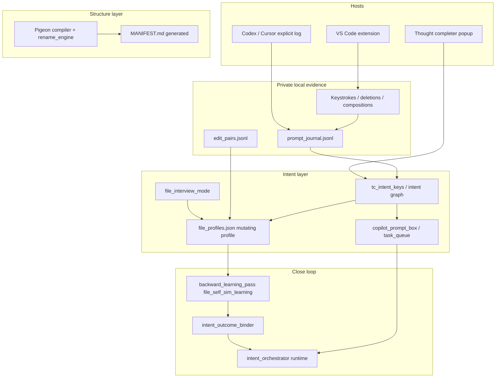

# Runtime Hosts, Naming, and Pipeline (2026-06)

This page is the operator-facing map for **keystroke-telemetry** as the local open-source auditor. It does not rename pigeon load-bearing filenames; it explains what the names *mean* and which layers are live vs parallel.

## One-sentence product

**Compiler-first repo auditor:** small files, safe renames, generated manifests, intent-key memory, and private local evidence (typing, deletions, patches) that steers the next agent turn — without shipping raw prompts to the cloud.

## Host support (what is actually wired)

| Surface | Keystroke / deletion capture | Intent keys + context pack | File interview | Post-commit pigeon pipeline |
|---|---|---|---|---|
| VS Code + Copilot | Yes (`vscode-extension/`, `client/os_hook.py`, UIA) | Via extension submit + `classify_bridge.py` | `py scripts/file_interview.py` | Yes (`.git/hooks/post-commit`) |
| Codex desktop | Best-effort via OS hook title match; primary path is **explicit** `codex_compat` | `log-prompt` / `pre-prompt` / `context-pack` | Same script | Yes when repo has hook |
| Cursor | **No first-class extension** — use explicit logging + project skills (e.g. LinkRouter file interview) | Same as Codex if you call `codex_compat` each turn | Same | Yes when repo has hook |
| Thought completer popup | Controlled composition (not ambient chat) | `--prompt-brain`, `--intent-key` | N/A | N/A |

There is no folder named `intent_signals` in this repo. In docs, **intent signals** means: keystroke/deletion telemetry + semantic profile events + generated intent keys — not a separate package.

## Two prompt spines (do not merge mentally)

1. **Live default spine** — `codex_compat.py` + post-commit `git_plugin` → `logs/prompt_journal.jsonl`, dynamic context pack, task queue, `.github/copilot-instructions.md` managed blocks.
2. **Manifest-as-state spine** (tested, parallel) — `prompt_manifest_compiler`, `manifest_state_protocol`, `build_prompt_context_packet.py` → `logs/copilot_prompt_box_latest.md`, folder `MANIFEST.md` state blocks.

The architectural goal is one spine: manifest gate + intent-key resurfacing **before** mutation. Today both exist; promoting (2) into every `pre-prompt` is the open wiring task.

## Layer map (your mental model → repo modules)



### Compiler / rename engine

- **`pigeon_compiler/`** — cut plans, `rename_engine/`, `git_plugin.py` post-commit orchestrator.
- **Standalone tool:** `pip install pigeon-code-compilor` (rename + manifest rebuild on any Python tree).
- Filenames like `dynamic_prompt_seq017_v003_d0317__..._lc_wire.py` are **identity**, not clutter.

### Intent keys (work-thread routing)

| Artifact / module | Role |
|---|---|
| `src/tc_intent_keys_seq001_v001.py` | Manifest-scored key: `scope:verb:target:scale` |
| `src/tc_intent_key_io_seq001_v001.py` | Writes `logs/intent_key_latest.json`, injects `codex:intent-key-context`, queues Prompt Box tasks |
| `src/tc_intent_file_memory_seq001_v001.py` | Which keys naturally wake which files (tests in `test_tc_intent_keys.py`) |
| `src/intent_orchestrator_seq001_v001.py` | Resurfaces intent analysis for matched runs |
| `src/intent_outcome_binder_seq001_v001.py` | Closes accepted edits back into intent memory |
| `logs/intent_keys.jsonl` | Append-only key history |

When a prompt matches an intent key, the intended behavior is: **open that key's history** (journal slices, folder manifest state, prior file comments) — implemented in pieces via intent graph + manifest compiler; full auto-resurface on every Cursor turn is not default yet.

### File learning / mutating profile

| Piece | Role |
|---|---|
| `src/file_interview_mode_seq001_v001.py` | Pre-edit "ask my files" — comments, alias, push trace, risk (`scripts/file_interview.py`) |
| `file_profiles.json` | Per-file learned profile; updated by `file_self_sim_learning` backward pass |
| `src/file_self_sim_learning_seq001_v001.py` | Sim packets, `backward_learning_pass`, reward into profiles |
| `src/tc_file_encoder_seq001_v001.py` | File-name / module intent encoding |
| Pulse blocks in `src/*.py` | `# telemetry:pulse` pairs prompt → save latency |

**Overlay model:** code-derived intent keys + file-learned keys + operator prompt → **mutating profile** that should eventually drive comments and patch predictions. File interview is the testimony layer; intent profile is the durable endpoint (see `docs/INTENT_MAP_CONTEXT_ROUTING_SYSTEMS_DOC.md`).

### Extraction from Copilot / Cursor / Codex edits

- **Copilot / VS Code:** pulse harvest, edit_pairs, post-commit narratives, partial `ai_responses.jsonl`.
- **Codex:** `codex_compat log-edit`, `capture-pair`, semantic profile on `log-prompt`.
- **Cursor:** same hooks only if the session **calls** `codex_compat` or project automation — not automatic in this repo.

### Prompt box + orchestrator

- **Prompt box:** `logs/copilot_prompt_box_latest.md` + `task_queue.json` entries with `intent_key` (see `prompt_manifest_compiler`, `tc_intent_key_io`).
- **Orchestrator resurfacing:** `intent_orchestrator`, `opus_orchestrator_runtime`, dynamic context pack — operator prompt + matched intent docs + file grounding.

### Bug profiles — two different things

1. **`docs/BUG_PROFILES.md`** — structural rogues gallery from **self_fix** (overcap `oc`, coupling `hc`, dead export `de`). Filename `β` suffix is pigeon bug branding. **Not** tied to intent keys today.
2. **Patch-derived "why this file keeps getting touched"** — partial via `backward_learning_targets` in file-sim packets, `rework_log.json`, `file_heat_map.json`, push-cycle narratives. **Missing glue (your hypothesis):** extract bug-shaped intent from each patch → attach to intent key → Prompt Box checklist → backwards pass crosses items off when patch + tests land.

That missing layer would connect: `edit_pairs` / patch diff → intent key bug slot → `copilot_prompt_box_latest.md` task → `file_self_sim_learning` backward pass scoring → refined file predictions on next prompt.

## Prefix cheat sheet (confusing names)

| Prefix / name | Means | Not |
|---|---|---|
| `tc_*` | Telemetry **compiler** intent layer (`tc_intent_keys`, `tc_prompt_brain`) | TypeScript |
| `codex_compat*` | Host adapter for **explicit** session events | "only Codex" — works for any host that logs |
| `seq###_v###_d####` in filenames | Pigeon load order, version, date | Cosmetic — do not "clean up" |
| `pigeon_brain` | Observer graph / flow engine | The main product (supporting) |
| `thought_completer` | Optional popup + intent-key brain | Required for all hosts |
| `file_interview_*` | Ask-files transcript in `logs/file_interview_latest.md` | MAIF web interview |

## Commands operators actually run

```powershell
# VS Code: install extension, enable post-commit hook (see README Setup)

# Codex / Cursor / CLI session — per prompt turn
py codex_compat.py log-prompt --prompt "your task" --deleted-text "words you removed"
py codex_compat.py context-pack --prompt "your task" --surface codex

# Before touching files (LinkRouter skill uses the same bridge)
py scripts/file_interview.py --question "what breaks if we change feed filter" --file app_routes/wire_feed_api.py

# Intent key + prompt box (popup or CLI)
py src/thought_completer.py --prompt-brain "wire debate feed filter"

# Manifest packet lane (parallel spine)
py scripts/build_prompt_context_packet.py

# Browse state while working
Get-Content logs/codex_state.md
Get-Content logs/file_interview_latest.md
Get-Content logs/copilot_prompt_box_latest.md
```

## LinkRouter.ai relationship

LinkRouter consumes the same ideas (file interview script, intent keys in `documentation/manifests/`, Pigeon post-commit). **This repo is the canonical auditor implementation;** LinkRouter is a product repo that should call into it, not duplicate the spine. Cursor agents should treat keystroke-telemetry as the plugin that *should* control pre-prompt routing when hooks are installed.

## Status summary

| Capability | Status |
|---|---|
| Pigeon compiler + rename + manifests | Live |
| VS Code keystroke + unsaid threads | Live |
| Codex explicit telemetry spine | Live |
| Cursor ambient keystrokes | Not in repo |
| Intent key → Prompt Box queue | Live (confidence gate) |
| Intent key → full history resurface | Partial |
| Manifest-as-state default spine | Parallel / explicit scripts |
| Bug profile ↔ intent key ↔ prompt box backwards cross-off | **Designed gap** — backward pass exists for file learning, not for self_fix β bugs per intent |

For deep audit history see [`ARCHITECTURE_CONSENSUS_v3.md`](ARCHITECTURE_CONSENSUS_v3.md). For Codex limits see [`CODEX_COMPAT.md`](CODEX_COMPAT.md). For intent-key grammar see [`THOUGHT_COMPLETER_INTENT_KEYS.md`](THOUGHT_COMPLETER_INTENT_KEYS.md).
